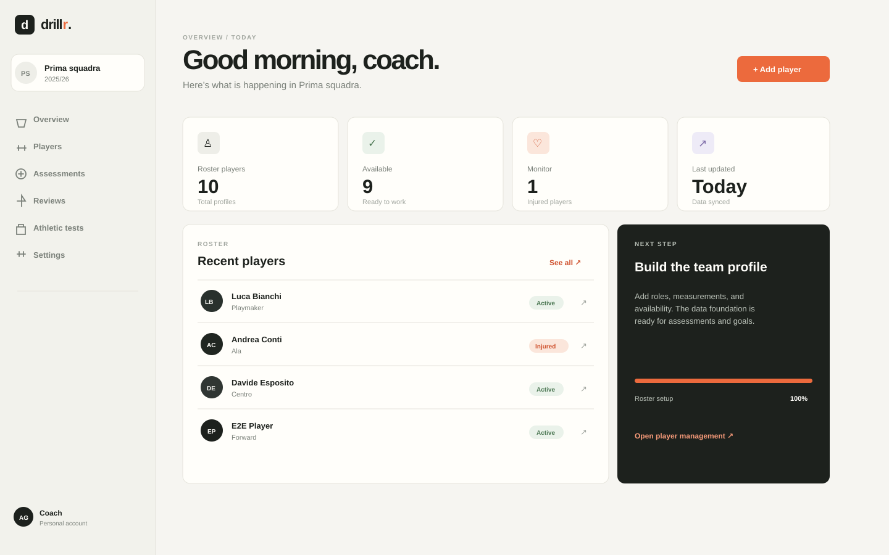
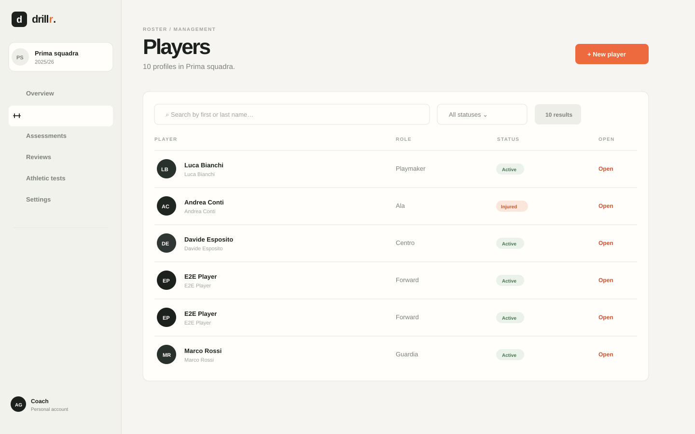
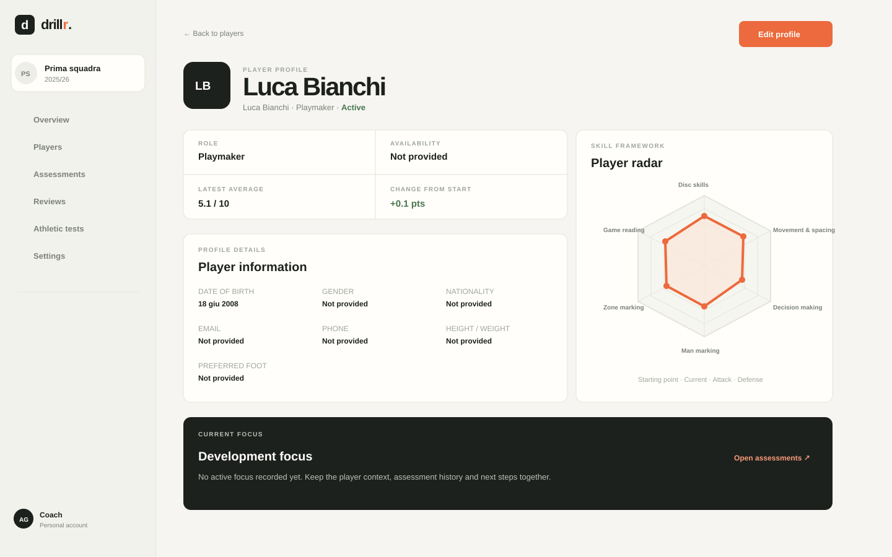

<div align="center">

# Drillr

### Coaching operations, without the dashboard noise.

Drillr è uno spazio operativo per coach e staff: roster, profili giocatore, valutazioni e contesto di squadra in un’unica interfaccia calma, compatta e pronta a crescere.

<p>
  <a href="#quick-start"><strong>Avvia la demo</strong></a> ·
  <a href="#product-preview"><strong>Guarda le schermate</strong></a> ·
  <a href="docs/architecture.md"><strong>Leggi l’architettura</strong></a>
</p>


</div>

<br />

## Il prodotto

Drillr parte da una domanda semplice: **come può uno staff prendere decisioni migliori sui giocatori, con meno attrito?**

Il MVP costruisce una base affidabile per il lavoro quotidiano del coach:

- una dashboard sintetica per capire subito lo stato della squadra;
- un roster ricercabile con filtri, stati e accesso rapido ai profili;
- profili giocatore completi, modificabili in pagine dedicate;
- valutazioni append-only con storico e radar delle skill;
- più squadre per account, con isolamento dei dati per proprietario e team;
- un framework di skill, ruoli e test configurabile dalle impostazioni;
- un design system responsive, accessibile e coerente.

## Product preview

Le anteprime sono asset locali versionabili, quindi funzionano anche quando il README viene letto offline o senza un deploy pubblico.

<p align="center">
  
</p>

<p align="center"><em>Una overview compatta: KPI del roster, giocatori recenti e prossimo step operativo.</em></p>

<table>
  <tr>
    <td width="50%" valign="top">
      
      <p align="center"><em>Roster management</em></p>
    </td>
    <td width="50%" valign="top">
      
      <p align="center"><em>Profilo giocatore e radar</em></p>
    </td>
  </tr>
</table>

## Quick start

### Demo locale

Servono Python 3.12+, Node.js e npm.

```bash
# terminale 1 — API FastAPI
cd backend
python3 -m venv .venv
source .venv/bin/activate
pip install -r requirements.txt
DEV_AUTH_BYPASS=true uvicorn app.main:app --reload --port 8000
```

```bash
# terminale 2 — frontend Vite
cd frontend
npm install
npm run dev
```

Apri [http://localhost:5173](http://localhost:5173). Senza una chiave Clerk configurata, Drillr mostra la demo locale e crea un workspace sintetico per `demo_user`.

### Docker Compose

```bash
DEV_AUTH_BYPASS=true docker compose up --build
```

Lo stack avvia PostgreSQL, API FastAPI e frontend statico servito da Nginx. Per usare Clerk, valorizza `VITE_CLERK_PUBLISHABLE_KEY`, `CLERK_JWT_KEY` e `CLERK_ISSUER` nel file `.env`, poi disabilita `DEV_AUTH_BYPASS`.

> `DEV_AUTH_BYPASS` è solo per sviluppo locale. Non abilitarlo in staging o produzione.

## Cosa include l’MVP

| Area | Funzionalità |
| --- | --- |
| Dashboard | KPI del roster, giocatori recenti, stato disponibilità e next step |
| Players | Ricerca, filtro stato, creazione, modifica, archiviazione soft e dettaglio |
| Player profile | Dati personali, sportivi, fisici, contatti, disponibilità e note staff |
| Assessments | Sei parametri di default, score 1–10 a incrementi di 0,5, radar e storico |
| Workspace | Più squadre per account con selezione persistente e dati isolati |
| Settings | Skill framework, ruoli e catalogo test configurabili per squadra |
| Access | Clerk JWT in produzione, bypass sintetico solo in demo locale |
| Quality | Stati loading, empty, error e success; focus keyboard; layout responsive |

## Stack

**Frontend**

- React + TypeScript + Vite
- React Router
- TanStack Query per lo stato server
- React Hook Form + Zod per i form
- Radix primitives e componenti UI locali in stile shadcn
- DM Sans + Space Grotesk, con design tokens centralizzati

**Backend**

- FastAPI + Pydantic v2
- SQLAlchemy + Alembic
- SQLite in demo, PostgreSQL-ready per ambienti reali
- Repository e service layer organizzati per dominio
- Middleware per CORS, correlation ID, security headers e logging strutturato

## Architettura in breve

```text
drillr/
├── frontend/
│   └── src/
│       ├── app/                 # bootstrap, provider e routing
│       ├── features/            # dashboard, players, settings, workspace
│       └── shared/              # layout, UI primitives, theme e utility
├── backend/
│   └── app/
│       ├── routers/             # HTTP boundary per dominio
│       ├── services/            # regole e orchestration
│       ├── repositories/        # data access boundary
│       ├── models/              # SQLAlchemy
│       └── schemas/             # DTO Pydantic
├── docs/
│   ├── architecture.md
│   ├── skill-framework.md
│   ├── testing.md
│   └── screenshots/             # preview locali per questo README
└── docker-compose.yml
```

Il flusso applicativo resta intenzionalmente esplicito:

```text
React view → feature hook/service → API router → service → repository → database
```

Ogni query e mutazione di dominio è vincolata a `owner_user_id` e `team_id`. Le valutazioni e le review sono append-only: il valore corrente è l’ultima riga per giocatore e skill, mentre lo storico rimane disponibile.

## Verifica locale

```bash
# backend
cd backend
pytest --cov=app --cov-report=term-missing

# frontend
cd frontend
npm run lint
npm run test
npm run build
```

Per il percorso E2E previsto:

```bash
cd frontend
npm run test:e2e -- --project=chromium
```

## Documentazione

- [Architettura](docs/architecture.md)
- [Skill framework e assessment history](docs/skill-framework.md)
- [Testing strategy](docs/testing.md)
- [Engineering guide](AGENTS.md)

## Roadmap

- [x] Dashboard e workspace multi-team
- [x] Player CRUD e profili completi
- [x] Skill framework e radar assessment
- [x] Goals, reviews e athletic tests come moduli di dominio
- [ ] Assessment comparison e trend più avanzati
- [ ] Goal tracking operativo per staff e giocatore
- [ ] Review workflow condiviso
- [ ] Libreria esercizi e training plans
- [ ] Auth production hardening e deploy osservabile

## License

Distribuito con licenza MIT. Vedi [LICENSE](LICENSE).
